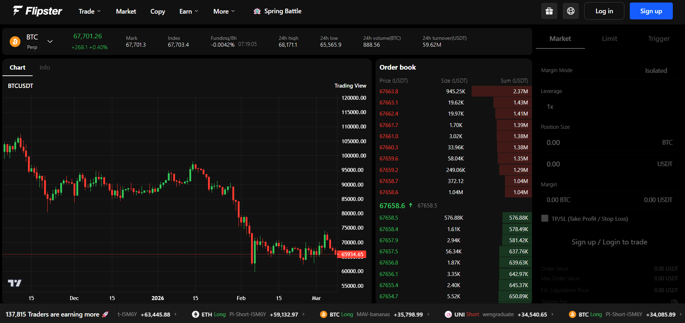
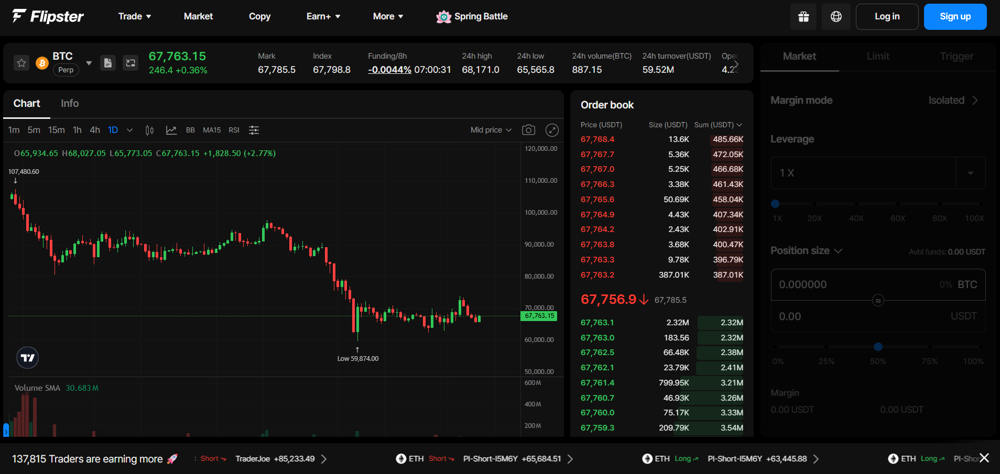

# Flipster Web UI

Flipster is a perpetual futures exchange for cryptocurrency trading.

This repository is a frontend clone of the [Flipster](https://flipster.io/) platform, designed to replicate its user interface and functionality. The backend acts as a proxy to the Flipster API, handling REST calls for market data and candlestick charts.

> **Note:** This project is for frontend design and learning purposes only. It makes read-only API calls to the Flipster backend, and no actual trading occurs here. Flipster holds the copyright to all associated assets and functionality.

## User Interface

### Cloned Flipster Design



### Actual Flipster Design

Note: Some differences may exist. The TradingView chart implementation uses hardcoded timestamps on the backend - properly implementing this would require understanding Flipster's exact caching window strategy for dynamic timestamp calculation.



## API

**Note:** Couldn't create an API key directly, so used the frontend to reverse engineer API calls and headers.

Upon initial load, the following API calls are made:

1. `/specs` - Retrieves all available trading pairs and market specs.
2. `/klines?symbol=BTCUSDT.PERP&interval=1440` - Fetches the chart candlestick data (currently hardcoded to 1D timeframe with fixed timestamps: `1736640000-1779753600`).
3. `/winners` - Retrieves top performing markets.

WebSocket integration for real-time orderbook and trades:

- Subscribe to market depth/orderbook data for live bid/ask updates
- Subscribe to recent trades stream
- Subscribe to ticker updates

## Architecture

1. The frontend replicates the Flipster UI design.
2. The candlestick chart is rendered using TradingView's lightweight-charts library with data fetched from the backend proxy.
3. Real-time orderbook and trade data displayed via WebSocket connections.

4. **Current Limitations:**
   - Chart timestamps are hardcoded on backend (`1736640000-1779753600` for all intervals)
   - Would need to reverse engineer Flipster's caching window algorithm for proper dynamic timestamp calculation
   - Only 1D timeframe currently implemented due to timestamp complexity

5. **Other Features:**
   - Market selector dropdown for switching between trading pairs
   - Live orderbook with smooth transitions
   - Recent trades feed
   - Winners/top movers display
   - Position and orders interface (login required)

## Technical Specifications

- Built using **React**, **Node.js**, and **TypeScript**.
- **TradingView's [`lightweight-charts`](https://github.com/tradingview/lightweight-charts)** library is used to render the candlestick chart.
- Backend proxies requests to Flipster API with proper headers and CORS handling.
- WebSocket integration for real-time market data.

## Setup and Installation

### Backend

```bash
cd backend
npm install
npm run dev
```

Runs on port 7000.

### Frontend

Update `PROXY_SERVER_URL` in `frontend/src/services/api.ts` to `http://localhost:7000`

```bash
cd frontend
npm install
npm run dev
```

Go to <http://localhost:5173>
